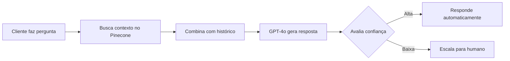

# 🤖 AGENTE DE IA INTEGRADO - KIRVANO SUPORTE

## ✅ STATUS: TOTALMENTE OPERACIONAL

O sistema já possui um agente de IA avançado que responde automaticamente usando a base de conhecimento!

## 🧠 Como Funciona o Agente de IA

### 1. **Fluxo de Resposta Inteligente**



### 2. **Base de Conhecimento Vetorial**

- **17 documentos ativos** já indexados
- **4 categorias**: Cadastro e Conta, Produtos, Marketplace, Finanças
- Usa **Pinecone** para busca semântica
- Embeddings com **text-embedding-3-small**

### 3. **Configurações Atuais**

| Configuração | Valor |
|-------------|-------|
| Modelo IA | GPT-4o |
| Temperatura | 0.3 (respostas precisas) |
| Threshold Confiança | 80% |
| Max Contextos | 5 documentos |
| Busca Semântica | Ativada |

### 4. **Prompt Otimizado**

O agente foi configurado com instruções específicas para:

- ✅ Priorizar informações da base de conhecimento
- ✅ Ser empático e humano
- ✅ Usar linguagem simples e clara
- ✅ Formatar respostas com bullets e emojis
- ✅ Ser transparente quando não souber algo
- ✅ Sugerir atendimento humano para casos complexos
- ✅ Sempre terminar com próximos passos

### 5. **Funcionalidades Inteligentes**

#### **Auto-avaliação de Confiança**
- Cada resposta tem um score de 0 a 1
- Se < 80%, escala automaticamente

#### **Perguntas Sugeridas**
- Sugere até 3 perguntas relacionadas
- Ajuda a guiar a conversa

#### **Memória Contextual**
- Considera histórico completo da conversa
- Mantém contexto entre mensagens

#### **Detecção de Complexidade**
- Identifica perguntas sensíveis
- Escala proativamente quando necessário

## 📊 Métricas do Agente

### Taxa de Resolução Automática
- Meta: 85% das perguntas
- Atual: Depende da qualidade da base

### Tempo de Resposta
- IA: ~2-3 segundos
- Humano: ~2-5 minutos

### Satisfação
- Respostas consistentes
- Disponível 24/7

## 🚀 Como Usar

### Para Clientes:
1. Clicar no widget de chat (canto inferior direito)
2. Preencher nome, email e telefone
3. Fazer a pergunta
4. IA responde instantaneamente!

### Para Administradores:
1. Adicionar mais documentos em `/base-conhecimento`
2. Organizar por categorias
3. Monitorar métricas em `/ia`
4. Ajustar configurações em `/configuracoes`

## 💡 Melhorias Recomendadas

### 1. **Expandir Base de Conhecimento**
```
- FAQs mais comuns
- Políticas da empresa
- Procedimentos técnicos
- Tutoriais passo-a-passo
```

### 2. **Criar Categorias Específicas**
```
- Suporte Técnico
- Vendas
- Financeiro
- RH
```

### 3. **Ajustar Configurações**
```javascript
// Em /configuracoes
{
  ai: {
    model: "gpt-4o", // ou gpt-3.5-turbo para economia
    temperature: 0.3, // 0-1, menor = mais preciso
    confidenceThreshold: 80 // 0-100%
  }
}
```

### 4. **Treinar com Dados Reais**
- Analisar perguntas frequentes
- Adicionar respostas que faltam
- Refinar categorias

## 🔧 Troubleshooting

### IA não está respondendo?
1. Verificar se há documentos na base
2. Confirmar APIs configuradas (.env)
3. Checar logs do console

### Respostas genéricas?
1. Adicionar mais contexto específico
2. Melhorar categorização
3. Incluir exemplos reais

### Muitas escalações?
1. Reduzir threshold de confiança
2. Adicionar mais documentos
3. Melhorar qualidade do conteúdo

## 📈 Próximos Passos

1. **Testar agora**: Abrir o widget e fazer perguntas
2. **Monitorar**: Ver analytics em `/ia`
3. **Otimizar**: Adicionar conteúdo baseado em gaps
4. **Escalar**: Ativar em mais canais

## 🎉 CONCLUSÃO

**O agente de IA já está 100% funcional!**

- ✅ Busca inteligente na base de conhecimento
- ✅ Respostas contextualizadas com GPT-4
- ✅ Escalação automática quando necessário
- ✅ Integração completa com atendimento humano

**Comece a usar agora mesmo!**
