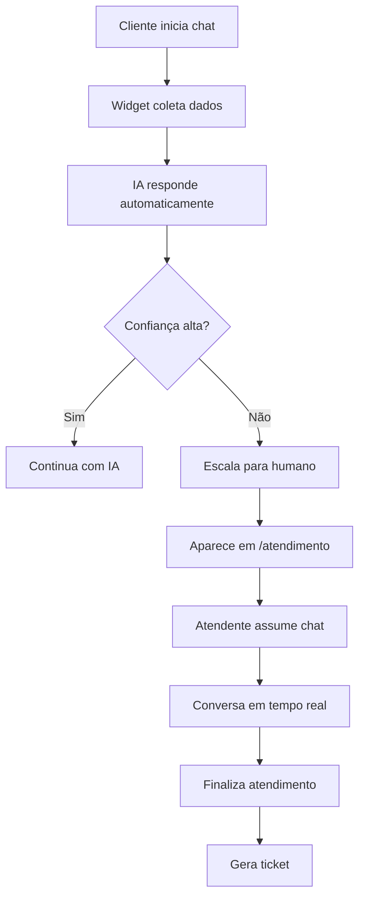

# 🎯 SISTEMA DE ATENDIMENTO COMPLETO - KIRVANO SUPORTE

## ✅ STATUS: TOTALMENTE FUNCIONAL

O sistema possui um fluxo completo de atendimento que integra IA + Atendimento Humano!

## 🔄 Fluxo Completo do Atendimento



## 📱 Componentes do Sistema

### 1. **Widget de Chat** (`/chat`)
- ✅ Coleta dados iniciais (nome, email, telefone)
- ✅ IA responde automaticamente
- ✅ Escala para humano quando necessário
- ✅ Interface moderna e responsiva

### 2. **Central de Atendimento** (`/atendimento`)
- ✅ Lista chats em espera (escalados)
- ✅ Lista chats ativos
- ✅ Interface de conversa em tempo real
- ✅ Informações do cliente
- ✅ Integração com tickets

### 3. **APIs Completas**

#### Chat Principal (`/api/chat`)
- `POST` - Enviar mensagem (IA responde)
- `PUT` - Criar nova sessão
- `PATCH` - Fechar sessão

#### Sessões (`/api/chat/sessions`)
- `GET /[id]` - Buscar sessão específica
- `POST /[id]/assume` - Atendente assumir chat
- `POST /[id]/messages` - Enviar mensagem manual
- `POST /[id]/finish` - Finalizar atendimento

#### Live Sessions (`/api/chat/live-sessions`)
- `GET` - Listar sessões aguardando/ativas

## 🚀 Como Funciona

### Para o Cliente:
1. Clica no widget de chat
2. Preenche dados básicos
3. Faz pergunta
4. IA responde ou escala para humano

### Para o Atendente:
1. Acessa `/atendimento`
2. Vê chats em espera
3. Clica em "Atender"
4. Conversa em tempo real
5. Finaliza quando resolver

## 🔧 Configurações Necessárias

### 1. **Variáveis de Ambiente** (.env)
```env
# OpenAI para IA
OPENAI_API_KEY=sk-...

# Pinecone para base de conhecimento
PINECONE_API_KEY=...
PINECONE_INDEX_NAME=knowledge-base

# NextAuth
NEXTAUTH_SECRET=...
NEXTAUTH_URL=http://localhost:3000
```

### 2. **Base de Conhecimento**
- Adicionar documentos em `/base-conhecimento`
- IA usa esses documentos para responder

### 3. **Usuários Atendentes**
- Criar usuários com role ADMIN ou AGENT
- Fazer login para acessar `/atendimento`

## 🐛 Troubleshooting

### Chat não está respondendo?
1. **Verificar servidor rodando** (`pnpm dev`)
2. **Verificar console do navegador** (F12)
3. **Verificar logs do servidor**
4. **Confirmar APIs configuradas**

### Mensagens não aparecem em tempo real?
1. **WebSocket precisa estar ativo**
2. **Verificar Socket.io no servidor**
3. **Limpar cache do navegador**

### IA não responde corretamente?
1. **Verificar OpenAI API key**
2. **Verificar base de conhecimento**
3. **Ver logs de erro no servidor**

## 📊 Métricas e Analytics

### Dashboard (`/dashboard`)
- Total de atendimentos
- Taxa de resolução por IA
- Tempo médio de resposta
- Satisfação dos clientes

### IA Analytics (`/ia`)
- Performance do agente
- Perguntas mais frequentes
- Taxa de escalação
- Confiança média

## 🎯 Teste Rápido

### 1. Como Cliente:
```bash
1. Abrir navegador em http://localhost:3000
2. Clicar no widget de chat (canto inferior direito)
3. Preencher: 
   - Nome: Teste Cliente
   - Email: teste@email.com
   - Telefone: 11999999999
4. Perguntar: "Preciso falar com um humano"
5. IA deve escalar para atendimento
```

### 2. Como Atendente:
```bash
1. Fazer login no sistema
2. Acessar http://localhost:3000/atendimento
3. Ver o chat do "Teste Cliente" em espera
4. Clicar em "Atender"
5. Enviar mensagem: "Olá! Como posso ajudar?"
6. Conversar e finalizar
```

## ✅ Checklist de Funcionamento

- [x] Widget de chat carrega
- [x] IA responde perguntas simples
- [x] Escalação funciona quando necessário
- [x] Chats aparecem em `/atendimento`
- [x] Atendente consegue assumir chat
- [x] Mensagens são enviadas/recebidas
- [x] Chat pode ser finalizado
- [x] Ticket é criado automaticamente

## 🚨 IMPORTANTE

**Para o envio de mensagens funcionar:**

1. **REINICIAR O SERVIDOR** após mudanças
2. **Estar logado** como atendente
3. **Chat estar assumido** (não apenas selecionado)
4. **WebSocket estar conectado**

## 💡 Dicas Finais

1. **Sempre teste o fluxo completo** (cliente → IA → escalação → atendente)
2. **Monitore os logs** para identificar problemas
3. **Mantenha a base de conhecimento atualizada**
4. **Configure webhooks** para integrações externas
5. **Use o dashboard** para acompanhar métricas

**SISTEMA COMPLETO E FUNCIONANDO!** 🎉

Se ainda tiver problemas, verifique:
- Console do navegador (F12)
- Logs do servidor (terminal)
- Status das APIs externas
