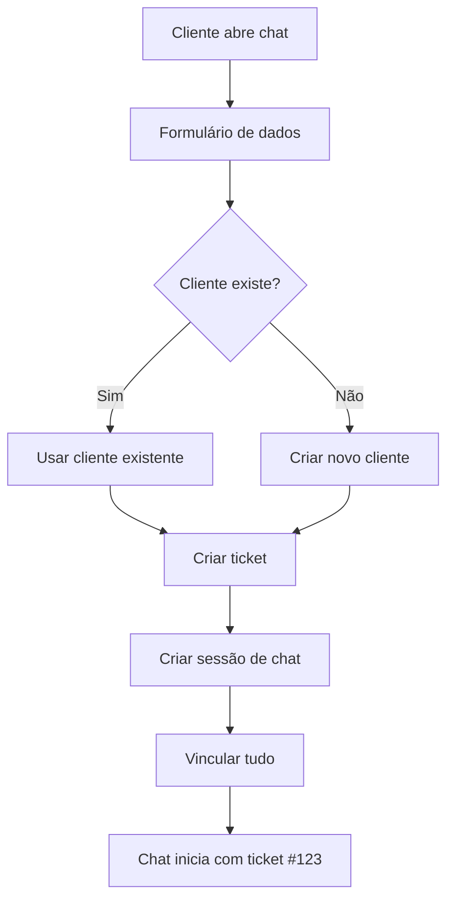

# Integração Chat com Tickets

## 🎯 Visão Geral

Todos os chats iniciados no sistema automaticamente:
1. Coletam dados obrigatórios (nome, email, telefone)
2. Criam ou atualizam registro de cliente
3. Geram um ticket rastreável
4. Unificam histórico do cliente

## 📊 Fluxo de Dados



## 🗄️ Estrutura do Banco

### ChatSession
```prisma
model ChatSession {
  // ... campos existentes
  userPhone   String?   // novo: telefone
  clientId    String?   // novo: vínculo com cliente
  ticketId    String?   // novo: vínculo com ticket
  
  client      Client?   @relation(...)
  ticket      Ticket?   @relation(...)
}
```

### Client
```prisma
model Client {
  email        String   @unique
  name         String?
  phone        String?
  // ... outros campos
  
  tickets      Ticket[]
  chatSessions ChatSession[]
}
```

## 🔧 Como Funciona

### 1. Widget do Chat
- Exibe formulário antes de iniciar conversa
- Campos obrigatórios: Nome, E-mail, Telefone
- Validação em tempo real

### 2. Busca/Criação de Cliente
```javascript
// Busca por email OU telefone
let client = await prisma.client.findFirst({
  where: {
    OR: [
      { email: userEmail },
      { phone: userPhone }
    ]
  }
})

// Se não existe, cria novo
if (!client) {
  client = await prisma.client.create({
    data: { email, name, phone }
  })
}
```

### 3. Criação do Ticket
```javascript
const ticket = await prisma.ticket.create({
  data: {
    subject: `Chat iniciado - ${userName}`,
    description: `Chat iniciado em ${new Date().toLocaleString('pt-BR')}`,
    status: "OPEN",
    source: "chat",
    clientId: client.id,
    category: "Chat Support",
  }
})
```

### 4. Vinculação Completa
- ChatSession → Client
- ChatSession → Ticket  
- Ticket → Client

## ⚙️ Configurações

### API do Chat (`/api/chat/route.ts`)
- PUT: Cria sessão com dados obrigatórios
- POST: Envia mensagens
- PATCH: Fecha sessão

### Validações
- Nome: obrigatório
- E-mail: obrigatório e válido
- Telefone: obrigatório

### Unificação de Registros
Prioridade de busca:
1. E-mail (único)
2. Telefone
3. Nome (última opção)

## 📈 Benefícios

### Para o Cliente
- ✅ Histórico unificado
- ✅ Não precisa repetir informações
- ✅ Acompanhamento do ticket

### Para o Suporte
- ✅ Visão 360° do cliente
- ✅ Todos os chats viram tickets
- ✅ Métricas e relatórios precisos
- ✅ Sem duplicação de clientes

## 🚀 Próximos Passos

### 1. Adicionar na página de Tickets
- Filtro por source = "chat"
- Badge indicando origem
- Link para histórico do chat

### 2. Notificações
- Quando chat é escalado
- Quando ticket do chat é atualizado

### 3. Automações
- Fechar ticket quando chat encerra
- Escalar ticket se confiança baixa
- Categorizar por assunto da conversa

## 📊 Métricas Disponíveis

- Total de chats que viraram tickets
- Taxa de resolução por chat vs email
- Tempo médio de atendimento por canal
- Clientes recorrentes (múltiplos tickets)

## 🛠️ Manutenção

### Atualizar Cliente
Se cliente já existe mas falta algum dado:
```javascript
if (!client.phone && userPhone) {
  await prisma.client.update({
    where: { id: client.id },
    data: { phone: userPhone }
  })
}
```

### Incrementar Contador
```javascript
await prisma.client.update({
  where: { id: client.id },
  data: { totalTickets: { increment: 1 } }
})
```

## 🔒 Segurança

- Dados validados no backend
- Sanitização de inputs
- Sessões com timeout
- Histórico auditável
