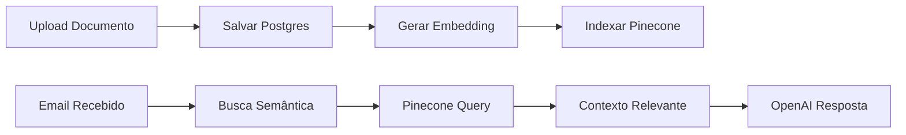

# Integração Pinecone - InboxPilot

## 🚀 Visão Geral

O Pinecone foi integrado ao InboxPilot para fornecer busca semântica avançada na base de conhecimento, melhorando significativamente a precisão das respostas automáticas.

## 📋 O que foi implementado

### 1. **Biblioteca Pinecone** (`lib/pinecone.ts`)
- ✅ Cliente Pinecone configurado
- ✅ Geração de embeddings com OpenAI
- ✅ Indexação de documentos
- ✅ Busca por similaridade
- ✅ Gerenciamento de índices
- ✅ Funções de update/delete

### 2. **APIs Atualizadas**
- ✅ `app/api/knowledge/route.ts` - Indexa automaticamente no Pinecone ao criar
- ✅ `app/api/knowledge/search/route.ts` - Nova busca semântica
- ✅ `lib/openai.ts` - Usa Pinecone para contexto nas respostas

### 3. **Script de Migração**
- ✅ `scripts/migrate-to-pinecone.ts` - Migra dados existentes

## 🔧 Configuração

### Variáveis de Ambiente
```env
PINECONE_API_KEY=pcsk_2yfuoZ_7iHjUsWnNMaAobBa2Astxm5wjyUyXKuK1Xk4H5oB95XeGwW8nzkCmA14379R39S
PINECONE_INDEX_NAME=knowledge-base
```

### Especificações do Índice
- **Nome**: knowledge-base
- **Dimensão**: 1536 (text-embedding-3-small)
- **Métrica**: cosine
- **Cloud**: AWS
- **Region**: us-east-1

## 📊 Fluxo de Dados



## 🎯 Como Usar

### 1. Migrar Dados Existentes
```bash
# Instalar dependências do script
pnpm add -D dotenv

# Executar migração
pnpm tsx scripts/migrate-to-pinecone.ts
```

### 2. Busca Semântica via API
```typescript
// POST /api/knowledge/search
{
  "query": "como resetar senha",
  "category": "Cadastro e Conta", // opcional
  "limit": 5 // opcional, padrão 5
}
```

### 3. Upload de Novos Documentos
Documentos são automaticamente indexados no Pinecone ao serem criados via:
- Upload de Markdown
- Upload de PDF
- Criação manual

## 🔍 Vantagens da Busca Semântica

| Busca Tradicional | Busca Semântica (Pinecone) |
|-------------------|---------------------------|
| "resetar senha" | Encontra: "recuperar senha", "esqueci minha senha", "redefinir acesso" |
| Match exato | Entende sinônimos e contexto |
| Lenta com volume grande | Rápida mesmo com milhões de docs |
| Sem relevância | Score de similaridade |

## 📈 Monitoramento

### Logs importantes:
```
✅ Documento indexado no Pinecone: [título]
🔍 Buscando documentos similares para: [query]
✅ Encontrados X documentos relevantes
✅ Contexto encontrado via Pinecone
⚠️ Erro no Pinecone, usando fallback
```

### Métricas sugeridas:
1. Taxa de uso Pinecone vs Fallback
2. Tempo médio de busca
3. Score médio de similaridade
4. Taxa de acerto nas respostas

## 🛡️ Resiliência

O sistema possui fallback automático:
1. **Pinecone falha** → Busca tradicional no Postgres
2. **OpenAI falha** → Resposta genérica
3. **Embedding falha** → Documento salvo sem indexação

## 💰 Custos

### Pinecone (Free Tier):
- 100k vetores grátis
- 1 índice
- Queries ilimitadas

### OpenAI Embeddings:
- ~$0.0001 por documento
- ~$0.00002 por busca

## 🚦 Próximos Passos

1. **Imediato**:
   - [x] Testar migração com dados existentes
   - [ ] Verificar performance da busca
   - [ ] Monitorar logs de erro

2. **Futuro**:
   - [ ] Implementar cache de embeddings
   - [ ] Dashboard de métricas Pinecone
   - [ ] Filtros avançados (data, tags)
   - [ ] Reindexação automática periódica

## 🐛 Troubleshooting

### Erro: "Index not found"
```bash
# Verificar se o índice existe no Pinecone Dashboard
# Ou executar:
pnpm tsx -e "import { ensureIndexExists } from './lib/pinecone'; ensureIndexExists()"
```

### Erro: "Dimension mismatch"
- Verificar se está usando text-embedding-3-small (1536 dimensões)
- Deletar e recriar o índice se necessário

### Performance lenta
- Verificar região do índice (usar mais próxima)
- Implementar cache local
- Reduzir tamanho dos metadados

## 📚 Recursos

- [Pinecone Docs](https://docs.pinecone.io/)
- [OpenAI Embeddings](https://platform.openai.com/docs/guides/embeddings)
- [Next.js API Routes](https://nextjs.org/docs/app/building-your-application/routing/route-handlers)
